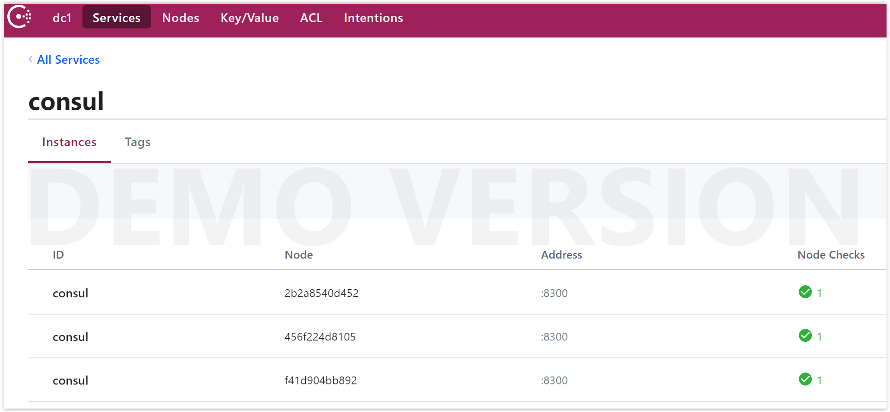

# Consul cluster using Docker

Start a primary Consul agent which others will connect too. Each of these agents will run as separate containers on the same node. 
In production, each of the containers would run on different machines. The agents will form the initial cluster and Consul Quorum 
for ensuring data stored is consistent and remains available after outages.

## Step 1: Start Primary Agent 

We use the official Docker image (consul:latest) and provide the arguments _agent -dev_. 
If the image is not already present, it will be downloaded first.
To make the UI accessible we tell Consul to bind to the public IP instead of 127.0.0.1. The UI runs on port 8500 which we map to the host.

Because we haven't told this agent to join a cluster, it will create one for us.

```bash
$ docker run -d --name=c1 -p 8500:8500 consul agent -dev -client=0.0.0.0 -bind=0.0.0.0
```

We use Docker to obtain the IP address of the first container we started. It should be in the 172.18.0.0 range.

```bash
$ IP=$(docker inspect --format '{{ .NetworkSettings.IPAddress }}' c1); echo $IP
172.18.0.2
```

## Step 2: Add Additional Agents

Once the primary agent has started, we can tell other agents to join the newly created cluster. 
Agents register using the provided the IP address of how to communicate with another Consul agent.

We start two additional agents (_c2 and c3_) and tell them how to locate the cluster (_-join=$IP_).
```bash
$ docker run -d --name c2 consul agent -dev -bind=0.0.0.0 -join=$IP
```
```bash
$ docker run -d --name c3 consul agent -dev -bind=0.0.0.0 -join=$IP
```

We now have a Consul cluster running on our Docker daemon. You can see the communicate and events via the logs:
```bash
$ docker logs c1
```

We can list all the members of a Consul cluster by asking one of our Containers:
```bash
$ docker exec -t c1 consul members
Node          Address          Status  Type    Build  Protocol  DC   Segment
2b2a8540d452  172.18.0.3:8301  alive   server  1.6.1  2         dc1  <all>
456f224d8105  172.18.0.2:8301  alive   server  1.6.1  2         dc1  <all>
f41d904bb892  172.18.0.4:8301  alive   server  1.6.1  2         dc1  <all>
```

## Step 3: Add Additional Agents

You can visit the Consul UI accessible on port 8500 via this link: http://0.0.0.0:8500/ui



**CONGRATULATION: You now have a Consul cluster running as Docker containers.**

## Simulate Outage: Kill an agent

We can simulate a network outage or machine failure, by killing the _c2_ agent:
```bash
$ docker kill c2
```

After a couple of seconds, the heartbeat and health check will fail. The state of the member will change from _active_ to _failed_.
If this node was elected the leader then another election would have taken place.
```bash
$ docker exec -t c1 consul members
Node          Address          Status  Type    Build  Protocol  DC   Segment
2b2a8540d452  172.18.0.3:8301  alive   server  1.6.1  2         dc1  <all>
456f224d8105  172.18.0.2:8301  failed  server  1.6.1  2         dc1  <all>
f41d904bb892  172.18.0.4:8301  alive   server  1.6.1  2         dc1  <all>
```
